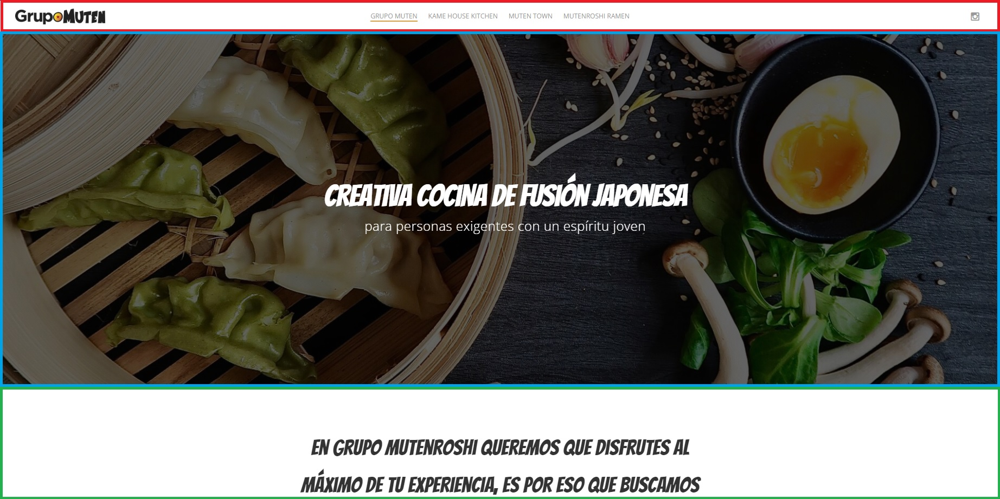
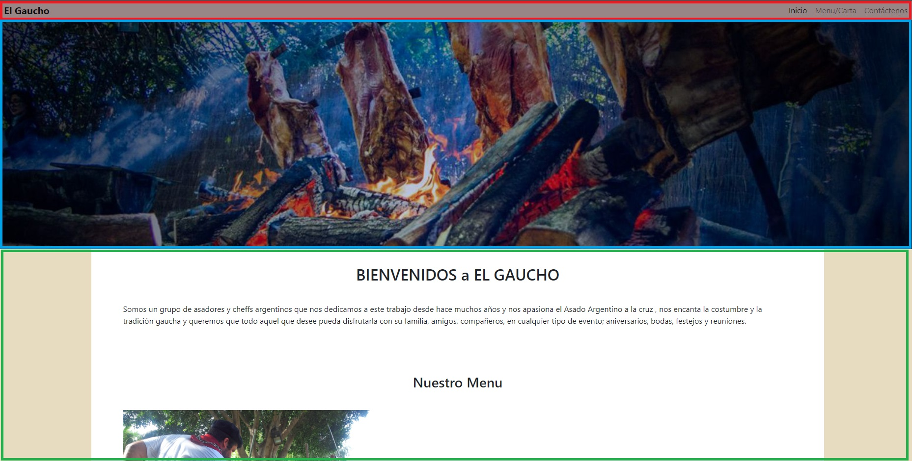
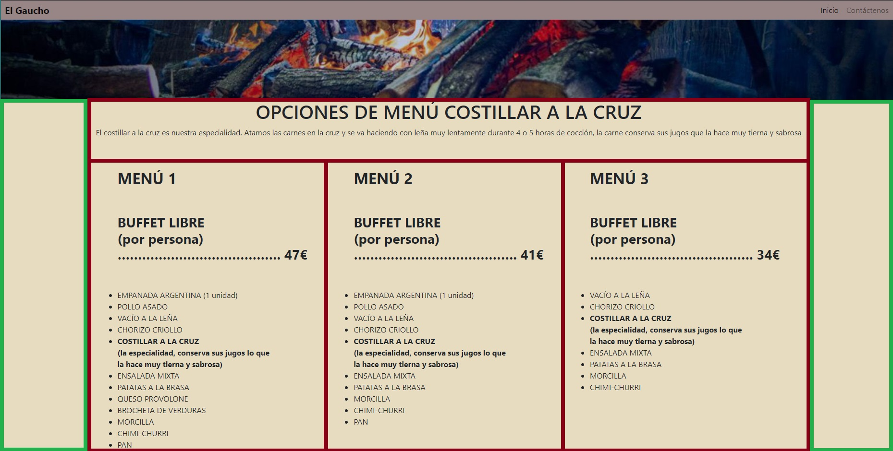
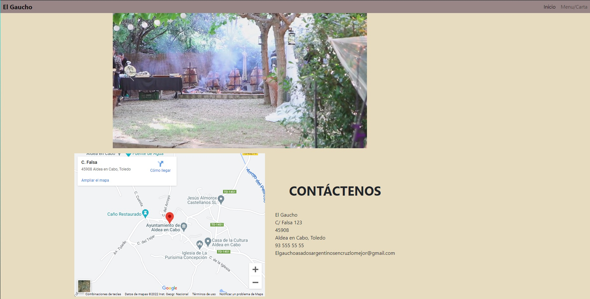

<h1>Página web</h1>

Para nuestro segundo proyecto se nos pidio que hicieramos una página para un supuesto restaurante.
Esta tiene que tener dos páginas más hiperconectadas y funcionales. A continuacion, detallare
los procedimientos que segui.

<h2>Desarrollo</h2>

En primer lugar busque páginas web para tener una idea clara de cómo queria diseñar la página.
Y al final decidí hacer una estructura que he visto que tienen varias webs actualmente.

En la siguiente imagen, podemos ver un ejemplo. En rojo, tenemos la barra de navegacion, en azul una 
foto relacionada con la comida del restaurante y en verde esta el texto explicativo y el resto de la 
informacion sobre el lugar. Mi objetivo es hacer algo parecido a esto.

Una vez decido el diseño, lo siguiente fue elegir cual seria el tema del restaurante. Me decidí por
un restaurante argentino de asado. Y lo llame El Gaucho. Con todo listo, dividí el trabajo en pequeños trabajos 
para centarme en una cosa a la vez:

1ro - HTML
2do - CSS
3ro - Detalles

Lo primero que hice fue los 3 HTML (Index, Contacto, Menu/Carta), donde puse elementos Bootstrap (como
la barra de navegacion y un carrusel), los titulos y el texto.

Una vez tuve los HTML listos, me puse con el CSS. Decidí hacer un archivo Styles para cada HTML y así 
no perderme con los nombres que posiblemente usaría en para referirme a una clase.

El primer resultado fue el index.

Como se puede apreciar en la imagen, he respetado y seguido el anterior ejemplo de página web.
Tiene la barra de navegacion, la foto relacionada al tema del restaurante y una pequeña introduccion.

La siguiente parte fue acabar el menú.

Aqui cambié un poco la estructura, dejé la foto anterior. Pero hice uniforme el color del fondo y
la mayor parte es texto. Lo que hice fue dividir la página en tres y dejar la parte del centro más
centrada y visible. Además, hice una ditribucion en el centro de tres divs para hacerlo visualmente 
más fácil de leer.

Por último, tenemos la página de contactos.

Aqui tuve problemas con el carrusel, que pude "solventar". En él vemos un poco el sitio del restaurante.
Añadí un mapa de Google para poder encontrar fácilmente el lugar, ademas de los datos típicos de contacto.

Por último, revisé y puse algunos detalles. Como por ejemplo que la barra de navegacion te siguiera aunque bajaras
la página. 

<h2>Herramientas</h2>

- HMTL5
- CSS3

<h2>Diseño y produccion</h2>

Lionel M. Garcia Bustos